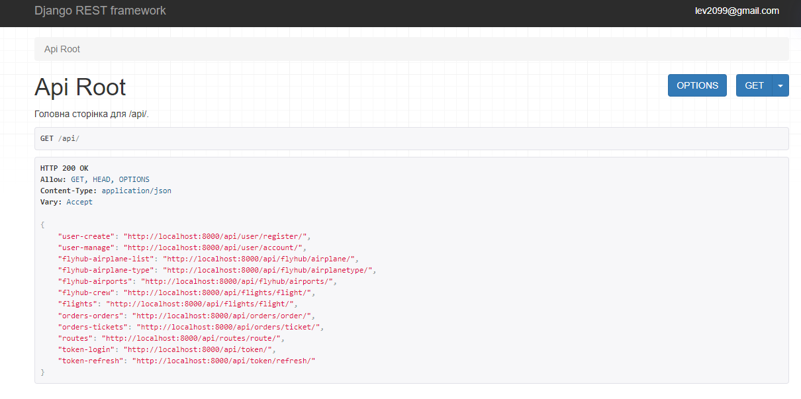

# FlyHub API

This repository contains a Django REST Framework (DRF) implementation of FlyHub, an application for managing flights, airplanes, airports, and crew. Below, you'll find details about setting up the project, its API structure, and other key features.

---

## Prerequisites

- Python 3.13+
- PostgreSQL
- Docker Desktop

## Setup Instructions

1. **Clone the Repository:**
   ```bash
   git clone https://github.com/Lev2098/flyhub_api.git
   cd flyhub
   ```

2. **Create and Activate a Virtual Environment:**
   ```bash
   python -m venv .venv
   source .venv/bin/activate  # On Windows: .venv\Scripts\activate
   ```

3. **Install Dependencies:**
   ```bash
   pip install -r requirements.txt
   ```

4. **Setup Environment Variables:**
   Create a `.env` file in the project root with the following content:
   ```env
   POSTGRES_PASSWORD=flyhub_service
   POSTGRES_USER=flyhub_service
   POSTGRES_DB=flyhub_service
   POSTGRES_HOST=db
   POSTGRES_PORT=5432
   SECRET_KEY=...
   ACCESS_TOKEN_LIFETIME=1
   REFRESH_TOKEN_LIFETIME=3
   ```

5. **Run Migrations:**
   ```bash
   python manage.py makemigrations
   python manage.py migrate
   ```

6. **Create a Superuser:**
   ```bash
   python manage.py createsuperuser
   ```

7. **Start the Development Server:**
   ```bash
   python manage.py runserver
   ```

Visit [http://127.0.0.1:8000/api/](http://127.0.0.1:8000/api/) to access the application.(NEED AUTHORIZATION JWT CAN USE ModHeader)

---

## Docker Setup

Docker is used to containerize the application for easier deployment.

### Prerequisites

- Docker installed on your machine
- Docker Compose (if applicable)

### Steps to Run the Application with Docker

1. Build the Docker image:
   ```bash
   docker build -t project-image .
   ```

2. Run the Docker container:
   ```bash
   docker run -d -p 8000:8000 --name project-container project-image
   ```

3. Access the application at `http://localhost:8000/`.

---

## API Documentation

### Authentication

FlyHub API uses token-based authentication. Obtain a token by sending a POST request to:
```http
http://127.0.0.1:8000/api/token/
```


Include JWT in the `Authorization` header for all requests:
```
Authorization: Bearer <your-token>
```

### Endpoints



---

## Key Features

1. **Dynamic Seat Management:**
   - Tracks row and seat availability for each flight.

2. **Nested Serializers:**
   - Supports detailed representations of airplanes and crew assignments.

3. **Custom Error Handling:**
   - Provides meaningful error messages for validation failures, such as duplicate ticket purchases.

---

## Development

### Running Tests
Run the test suite using:
```bash
python manage.py test
```

### Code Style
Ensure the code adheres to PEP 8 by running:
```bash
flake8 name_file
```

### API Browsable Documentation
The DRF browsable API can be accessed at [http://localhost:8000/api/](http://localhost:8000/api/) after running the development server.

---

## Contribution Guidelines

1. Fork the repository.
2. Create a feature branch:
   ```bash
   git checkout -b feature/your-feature-name
   ```
3. Commit your changes:
   ```bash
   git commit -m "Add your commit message"
   ```
4. Push to the branch:
   ```bash
   git push origin feature/your-feature-name
   ```
5. Open a pull request.

---

## License
This project is not licensed under the MIT License

---

## Contact
For support or inquiries, please contact the maintainer at [lev2099@gmail.com](mailto:lev2099@gmail.com).
